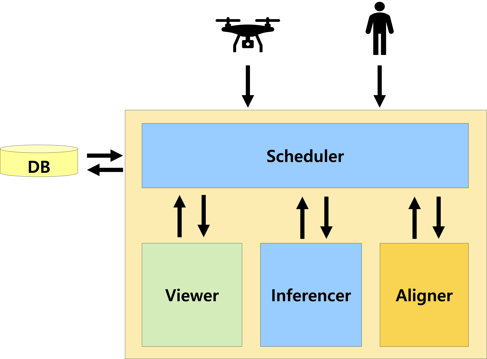
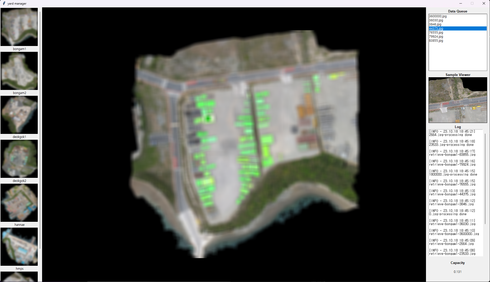

### 1. 프로젝트 소개
<br>
✔️ 규모가 매우 큰 야외 적치장(이하 야적장)에서는 사람의 눈으로 적재율이 어느 정도 되는지 알 수 없다.<br><br>
✔️ 적재된 물체를 Instance 별로 Segmentation하고, 적재율을 실시간으로 계산하는 시스템을 구현한다면, 물류 효율 증진을 위한 **'스마트 물류 시스템'** 을 구현할 수 있다.<br><br>
✔️ 따라서 우리는 실제 기업의 야적장 데이터를 이용해, 놓여진 다양한 물체들을 Detection 및 Segmentation 하는 Pipeline을 구축하고, 야적장 내 적재율을 실시간으로 계산하는 시스템을 제안한다.<br>


<br>

### 2. 팀 소개
<br>

✏️ Kim Kyung Hyun, klps44@naver.com, **데이터 전처리**, **Detection & Segmentation 알고리즘 설계**

✏️ Yu il hae, yih0826@pusan.ac.kr, **어플리케이션 제작 총괄 (BackEnd & FrontEnd)**

✏️ Shin Min Kun, zhdhfhd33@naver.com, **선행 연구 조사**, **Image Matching 알고리즘 설계**

<br><br>
### 3. 시스템 구성도

<br>

✔️ 본 시스템의 특징은 다음과 같다.
- **YOLAM: YOLOv8 + Segment Anything** 모델을 통한 실시간 물류 적재율 계산 End-to-End Pipeline을 제안<br><br>
- 작업자가 쉽게 사용할 수 있는 **어플리케이션을 제작**해 물류 효율을 증진시킬 수 있는 스마트 물류 어플리케이션 제작<br><br>
- **'컴퓨터비전개론'** 에서 배운 SIFT 및 RANSAC을 적용해 Image Match 및 Alinment<br><br>
- **'운영체제'** 에서 배운 Multi Thread 처리 방법인 Dead Lock 적용<br><br>

<br>

✔️ 전체적인 파이프라인은 다음과 같다.<br><br>


1.	Drone을 이용해 야적장 내 이미지를 촬영함<br>
2.	촬영 된 이미지는 메인 컴퓨터로 저장되어 전체 View를 구성함<br>
3.	이와 동시에 단일 이미지는 사용자 프로그램으로 전송되어 YOLAM에 input으로 들어감<br>
4.	Output으로 나온 segmented mask 이미지를 SIFT + RANSAC 알고리즘을 거쳐 전체 view에 Image matching 수행<br>
5.	Matching된 이미지를 프로그램 화면에 출력<br>
6.	전체 야적장의 free-space 비율을 함께 출력<br><br>

<br>

✔️ 작업자가 손쉽게 사용할 수 있도록 GUI를 구현했으며, 기능은 다음과 같다.<br><br>


1. Real-Time 야적장 viewer<br>
2. Drone에서 전송된 이미지 확인<br>
3. 현재 적재율 계산 및 출력<br>
4. 기능 개선 및 유지보수가 쉬운 OOP 구조<br><br>

   
<br>

✔️ 전체 프로그램 UI는 다음과 같다.<br><br>


- 야적장 상태를 Real-Time으로 모니터링하고, 적재율을 계산한다.
- 작업자는 회사의 전체 야적장 list을 좌측에서 확인할 수 있다.
- 계산된 야적장의 적재율은 우측 아래에 Real-Time으로 계산되어 출력된다.
- Drone이 송출하는 데이터 및 Image Processing Log를 우측에서 확인할 수 있다.


<br><br>
### 4. 소개 및 시연 영상

TBD

<br><br>
### 5. 설치 및 사용법

본 프로젝트는 Ubuntu 20.04 버전에서 개발되었으며 함께 포함된 다음의 스크립트를 수행하여 
관련 패키지들의 설치와 빌드를 수행할 수 있습니다.
```
$ ./install_and_build.sh
```
